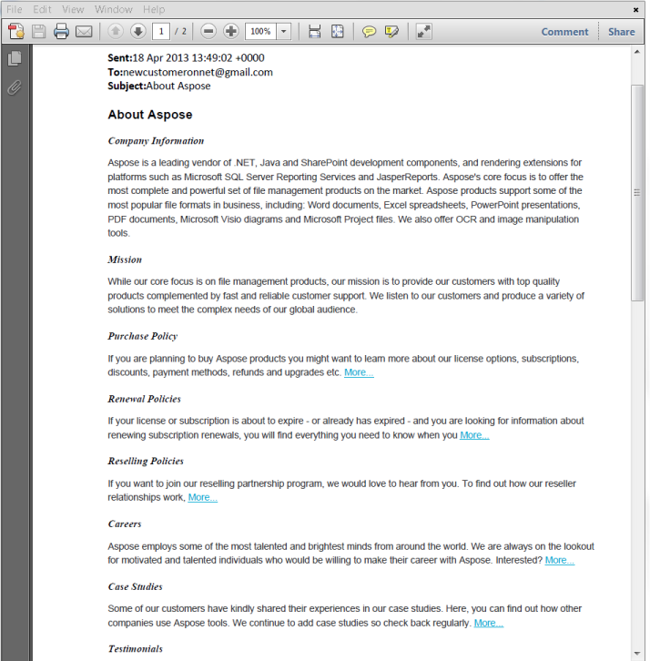

This article shows how to convert an email message to PDF using Aspose.Email.  Aspose.Email for .NET deals with network protocols and Microsoft Outlook features, and can not handle direct conversion to PDF. To overcome this, the samples in this article use Aspose.Email to convert the email message to the MHTML stream and then use Aspose.Words for .NET to load the MHTML stream and then save it as PDF.  An email message can contain attachments as well. Since each attachment can be of different media types, Aspose.Email ignores these attachments while converting to MHTML i.e. only inline images in a message will be part of MHTML and any regular attachments will be ignored.
## **Converting Email message to PDF**
The following code shows converting email messages to PDF using Aspose.Email in combination with Aspose.Words for .NET. This involves the following steps:

1. Load the email message using [MailMessage](https://apireference.aspose.com/net/email/aspose.email/mailmessage)
1. Save the email message to MemoryStream as MHTML
1. Load the stream using Aspose.Words
1. Save the message as PDF

The source email message can be seen as follow:


The converted PDF is as shown in the following image:



The following code snippet shows you how to convert email messages to PDF.

```csharp
string dataDir = RunExamples.GetDataDir_KnowledgeBase();
MailMessage mailMsg = MailMessage.Load(dataDir + "message3.msg");
MemoryStream ms = new MemoryStream();
mailMsg.Save(ms, Aspose.Email.SaveOptions.DefaultMhtml);

// create an instance of LoadOptions and set the LoadFormat to Mhtml
var loadOptions = new Aspose.Words.Loading.LoadOptions();
loadOptions.LoadFormat = LoadFormat.Mhtml;

// create an instance of Document and load the MTHML from MemoryStream
var document = new Aspose.Words.Document(ms, loadOptions);

// create an instance of HtmlSaveOptions and set the SaveFormat to Html
var saveOptions = new Aspose.Words.Saving.PdfSaveOptions();
document.Save(dataDir + "SaveEmailAsPDF_out.pdf", saveOptions);
```
