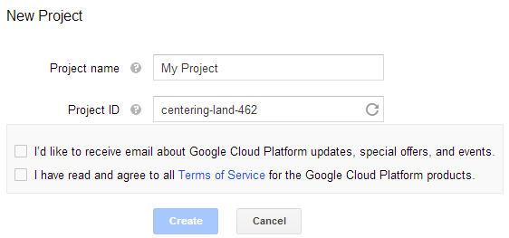
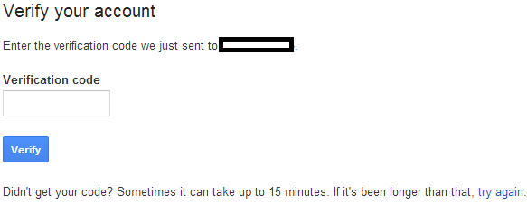

## **Working with FreeBusy Query**
Aspose.Email provides querying mechanism to check whether some appointment is due or not as per the criteria. FreebusyQuery class is provided for this purpose which allows to prepare a query for a particular calendar.
### **Querying a calendar**
This code sample demonstrates the feature of querying a calendar. Following tasks are performed in this sample:

1. Create and insert a calendar
1. Create an appointment
1. Insert appointment
1. Prepare a FreeBusyQuery
1. Get the FreebusyResponse


## **Creating project in Google Developer Console**
A Project is to be created on Google Developer Console for a user having Gmail account. In the API & auth -> Credentials page of the Google project, information is to be noted like Client ID and Client Secret. This information along with the gmail account user name and password will be required for executing the code e.g. google calendar, access control lists, appointments, contacts, settings etc. in this section.
### **Steps to create a project in Google Developer Console**
Following is a step by step tutorial for creating a project in Google Developer Console.

\1. Go to link <https://cloud.google.com/console/project> and login using your gmail credentials

||
| :- |
\2. Select the check box "I have read and agree to all Terms of Service for the Google Cloud Platform products." and Press Create button

||
| :- |
\3. "SMS Verification" will be requested. Press continue button:

||
| :- |
\4. Enter your country name and enter mobile number. Press button: Send Verification Code

||
| :- |
\5. Enter the verification code received on your mobile.

||
| :- |
\6. In the APIs & auth \ APIs list switch on status of Calendar API and Contacts API. Switch OFF all others.

||
| :- |
\7. On the APIs & auth -> Credentials, press button "CREAET NEW CLIENT ID" under "OAuth" section. Select "Installed application" and "Other" from the given choices, and press the "Create Client ID" button. Note the Client ID and Client Secret here that will be used in the sample codes in this section.

||
| :- |
## **Helper Classes**
Following helper classes are required to run the codes in this section. These classes GoogleOAuthHelper and GoogleTestUser are just for simplification of demonstration. The methods in these classes use non-public structure of web-pages that may change any time.
### **GoogleOAuthHelper Class**
The following code snippet shows you how to use GoogleOAuthHelper Class.


### **TestUser Class**
The following code snippet shows you how to use TestUser Class.


### **GoogleTestUser Class**
The following code snippet shows you how to use GoogleTestUser Class.


