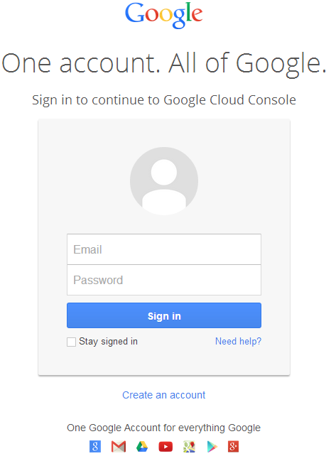
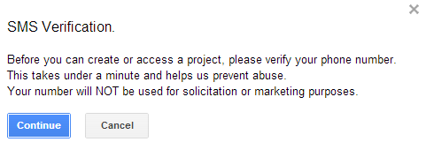
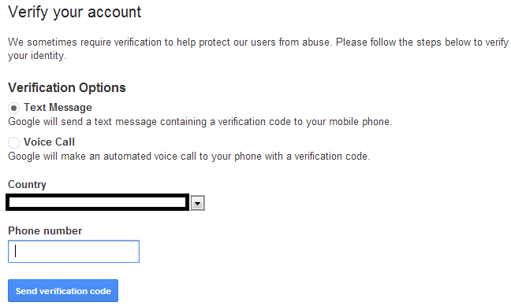

## **Working with FreeBusy Query**
Aspose.Email provides querying mechanism to check whether some appointment is due or not as per the criteria. FreebusyQuery class is provided for this purpose which allows to prepare a query for a particular calendar.
### **Querying a calendar**
This code sample demonstrates the feature of querying a calendar. Following tasks are performed in this sample:

1. Create and insert a calendar
1. Create an appointment
1. Insert appointment
1. Prepare a FreeBusyQuery
1. Get the FreebusyResponse

```csharp
// For complete examples and data files, please go to https://github.com/aspose-email/Aspose.Email-for-.NET

// Use the GoogleUser and GoogleOAuthHelper classes below to receive an access token
using (IGmailClient client = GmailClient.GetInstance(accessToken, user.Email))
{
    // Initialize calendar item
    Aspose.Email.Clients.Google.Calendar calendar1 = new Aspose.Email.Clients.Google.Calendar("summary - " + Guid.NewGuid().ToString(), null, null, "Europe/Kiev");

    // Insert calendar and get back id of newly inserted calendar and Fetch the same calendar using calendar id
    string id = client.CreateCalendar(calendar1);
    Aspose.Email.Clients.Google.Calendar cal1 = client.FetchCalendar(id);
    string calendarId1 = cal1.Id;
    try
    {
        // Get list of appointments in newly inserted calendar. It should be zero
        Appointment[] appointments = client.ListAppointments(calendarId1);
        if (appointments.Length != 0)
        {
            Console.WriteLine("Wrong number of appointments");
            return;
        }

        // Create a new appointment and Calculate appointment start and finish time
        DateTime startDate = DateTime.Now;
        DateTime endDate = startDate.AddHours(1);

        // Create attendees list for appointment
        MailAddressCollection attendees = new MailAddressCollection();
        attendees.Add("user1@domain.com");
        attendees.Add("user2@domain.com");

        // Create appointment
        Appointment app1 = new Appointment("Location - " + Guid.NewGuid().ToString(), startDate, endDate, "user2@domain.com", attendees);
        app1.Summary = "Summary - " + Guid.NewGuid().ToString();
        app1.Description = "Description - " + Guid.NewGuid().ToString();
        app1.StartTimeZone = "Europe/Kiev";
        app1.EndTimeZone = "Europe/Kiev";

        // Insert the newly created appointment and get back the same in case of successful insertion
        Appointment app2 = client.CreateAppointment(calendarId1, app1);

        // Create Freebusy query by setting min/max timeand time zone
        FreebusyQuery query = new FreebusyQuery();
        query.TimeMin = DateTime.Now.AddDays(-1);
        query.TimeMax = DateTime.Now.AddDays(1);
        query.TimeZone = "Europe/Kiev";

        // Set calendar item to search and Get the reponse of query containing 
        query.Items.Add(cal1.Id);
        FreebusyResponse resp = client.GetFreebusyInfo(query);
        // Delete the appointment
        client.DeleteAppointment(calendarId1, app2.UniqueId);
    }
    finally
    {
        // Delete the calendar
        client.DeleteCalendar(cal1.Id);
    }
}
```
## **Creating project in Google Developer Console**
A Project is to be created on Google Developer Console for a user having Gmail account. In the API & auth -> Credentials page of the Google project, information is to be noted like Client ID and Client Secret. This information along with the gmail account user name and password will be required for executing the code e.g. google calendar, access control lists, appointments, contacts, settings etc. in this section.
### **Steps to create a project in Google Developer Console**
Following is a step by step tutorial for creating a project in Google Developer Console.

1. Go to link <https://cloud.google.com/console/project> and login using your gmail credentials

||
| :- |
2. Select the check box "I have read and agree to all Terms of Service for the Google Cloud Platform products." and Press Create button

||
| :- |
3. "SMS Verification" will be requested. Press continue button:

||
| :- |
4. Enter your country name and enter mobile number. Press button: Send Verification Code

||
| :- |
5. Enter the verification code received on your mobile.

||
| :- |
6. In the APIs & auth \ APIs list switch on status of Calendar API and Contacts API. Switch OFF all others.

||
| :- |
7. On the APIs & auth -> Credentials, press button "CREAET NEW CLIENT ID" under "OAuth" section. Select "Installed application" and "Other" from the given choices, and press the "Create Client ID" button. Note the Client ID and Client Secret here that will be used in the sample codes in this section.

||
| :- |
## **Helper Classes**
Following helper classes are required to run the code examples in this section. These classes `GoogleOAuthHelper` and `GoogleUser` are just for simplification of demonstration. The methods in these classes use non-public structure of web-pages that may change any time.
### **GoogleOAuthHelper Class**
The following code snippet shows you how to implement `GoogleOAuthHelper` class.

```csharp
// For complete examples and data files, please go to https://github.com/aspose-email/Aspose.Email-for-.NET

using Newtonsoft.Json;
using System;
using System.Collections.Generic;
using System.IO;
using System.Net;
using System.Security.Cryptography;
using System.Text;

/// <summary>
/// Developer console:
/// https://console.cloud.google.com/projectselector2
/// Documentation:
/// https://developers.google.com/identity/protocols/oauth2/native-app
/// </summary>
internal class GoogleOAuthHelper
{
    public const string AUTHORIZATION_URL = "https://accounts.google.com/o/oauth2/v2/auth";
    public const string TOKEN_REQUEST_URL = "https://oauth2.googleapis.com/token";

    public const string REDIRECT_URI = "urn:ietf:wg:oauth:2.0:oob";
    public const string REDIRECT_TYPE = "code";

    public static string codeVerifier;
    public static string codeChallenge;

    public static CodeChallengeMethod codeChallengeMethod = CodeChallengeMethod.S256;

    public const string SCOPE =
        "https%3A%2F%2Fwww.googleapis.com%2Fauth%2Fcalendar" + // Calendar
        "+" +
        "https%3A%2F%2Fwww.google.com%2Fm8%2Ffeeds%2F" + // Contacts
        "+" +
        "https%3A%2F%2Fmail.google.com%2F"; // IMAP & SMTP

    static GoogleOAuthHelper()
    {
        CreateCodeVerifier();
        CreateCodeChallenge();
    }

    internal static string CreateCodeVerifier()
    {
        string allowedChars = "0123456789AaBbCcDdEeFfGgHhIiJjKkLlMmNnOoPpQqRrSsTtUuVvWwXxYyZz-._~";

        const int minLength = 43;
        const int maxLength = 128;

        Random random = new Random();
        int length = minLength + random.Next(maxLength - minLength);
        List<char> codeVerifierChars = new List<char>();

        for (int i = 0; i < length; i++)
        {
            int index = random.Next(allowedChars.Length);
            codeVerifierChars.Add(allowedChars[index]);
        }

        return codeVerifier = string.Join("", codeVerifierChars.ToArray());
    }

    internal static string CreateCodeChallenge()
    {
        if (codeChallengeMethod == CodeChallengeMethod.Plain)
            return codeChallenge = codeVerifier;

        byte[] hashValue = null;
        using (SHA256 sha256 = SHA256.Create())
            hashValue = sha256.ComputeHash(Encoding.ASCII.GetBytes(codeVerifier));

        string b64 = Convert.ToBase64String(hashValue);
        b64 = b64.Split('=')[0];
        b64 = b64.Replace('+', '-');
        b64 = b64.Replace('/', '_');

        return codeChallenge = b64;
    }

    internal static string GetAuthorizationCodeUrl(GoogleUser user)
    {
        return GetAuthorizationCodeUrl(user, SCOPE, REDIRECT_URI, REDIRECT_TYPE);
    }

    internal static string GetAuthorizationCodeUrl(
        GoogleUser user, string scope, string redirectUri, string responseType)
    {
        string state = System.Web.HttpUtility.UrlEncode(Guid.NewGuid().ToString());

        string approveUrl = AUTHORIZATION_URL +
            $"?client_id={user.ClientId}&redirect_uri={redirectUri}&response_type={responseType}&scope={scope}&" +
            $"code_challenge={codeChallenge}&code_challenge_method={codeChallengeMethod.ToString()}&" +
            $"state={state}";

        return approveUrl;
    }

    internal static TokenResponse GetAccessTokenByRefreshToken(GoogleUser user)
    {
        HttpWebRequest request = (HttpWebRequest)WebRequest.Create(TOKEN_REQUEST_URL);
        request.CookieContainer = new CookieContainer();
        request.Method = "POST";
        request.ContentType = "application/x-www-form-urlencoded";

        string clientId = System.Web.HttpUtility.UrlEncode(user.ClientId);
        string clientSecret = System.Web.HttpUtility.UrlEncode(user.ClientSecret);
        string refreshToken = System.Web.HttpUtility.UrlEncode(user.RefreshToken);
        string grantType = System.Web.HttpUtility.UrlEncode("refresh_token");

        string encodedParameters = $"client_id={clientId}&client_secret={clientSecret}&refresh_token={refreshToken}&grant_type={grantType}";

        byte[] requestData = Encoding.UTF8.GetBytes(encodedParameters);
        request.ContentLength = requestData.Length;
        if (requestData.Length > 0)
            using (Stream stream = request.GetRequestStream())
                stream.Write(requestData, 0, requestData.Length);

        HttpWebResponse response = (HttpWebResponse)request.GetResponse();
        string responseText = null;
        using (TextReader reader = new StreamReader(response.GetResponseStream(), Encoding.ASCII))
            responseText = reader.ReadToEnd();

        TokenResponse tokensResponse = JsonConvert.DeserializeObject<TokenResponse>(responseText);

        return tokensResponse;
    }

    internal static TokenResponse GetAccessTokenByAuthCode(string authorizationCode, GoogleUser user)
    {
        HttpWebRequest request = (HttpWebRequest)WebRequest.Create(TOKEN_REQUEST_URL);
        request.CookieContainer = new CookieContainer();
        request.Method = "POST";
        request.ContentType = "application/x-www-form-urlencoded";

        string clientId = System.Web.HttpUtility.UrlEncode(user.ClientId);
        string clientSecret = System.Web.HttpUtility.UrlEncode(user.ClientSecret);
        string authCode = System.Web.HttpUtility.UrlEncode(authorizationCode);
        string redirectUri = System.Web.HttpUtility.UrlEncode(REDIRECT_URI);
        string grantType = System.Web.HttpUtility.UrlEncode("authorization_code");

        string encodedParameters = $"client_id={clientId}&client_secret={clientSecret}&code={authCode}&code_verifier={codeVerifier}&redirect_uri={redirectUri}&grant_type={grantType}";

        byte[] requestData = Encoding.UTF8.GetBytes(encodedParameters);
        request.ContentLength = requestData.Length;
        if (requestData.Length > 0)
            using (Stream stream = request.GetRequestStream())
                stream.Write(requestData, 0, requestData.Length);

        HttpWebResponse response = (HttpWebResponse)request.GetResponse();
        string responseText = null;
        using (TextReader reader = new StreamReader(response.GetResponseStream(), Encoding.ASCII))
            responseText = reader.ReadToEnd();

        TokenResponse tokensResponse = JsonConvert.DeserializeObject<TokenResponse>(responseText);

        return tokensResponse;
    }

    public enum CodeChallengeMethod
    {
        S256,
        Plain
    }
}
```

**Google OAuth Helper** should be used as follows:
1. An authorization code URL has to be generated first.
1. Open the URL in a browser and complete all operations. As a result, you will receive an authorization code.
1. Use the authorization code to receive a refresh token.
1. When the refresh token exists, you may use it to retrieve access tokens.

```csharp
GoogleUser user = new GoogleUser(email, password, clientId, clientSecret);

string authUrl = GoogleOAuthHelper.GetAuthorizationCodeUrl(user);

Console.WriteLine("Go to the following URL and get your authorization code:");
Console.WriteLine(authUrl);
Console.WriteLine();

Console.WriteLine("Enter the authorization code:");
string authorizationCode = Console.ReadLine();
Console.WriteLine();

TokenResponse tokenInfo = GoogleOAuthHelper.GetAccessTokenByAuthCode(authorizationCode, user);
Console.WriteLine("The refresh token has been received:");
Console.WriteLine(tokenInfo.RefreshToken);
Console.WriteLine();

user.RefreshToken = tokenInfo.RefreshToken;
tokenInfo = GoogleOAuthHelper.GetAccessTokenByRefreshToken(user);
Console.WriteLine("The new access token has been received:");
Console.WriteLine(tokenInfo.AccessToken);
Console.WriteLine();
```

### **GoogleUser Class**
The following code snippet shows you how to implement `GoogleUser` class.

```csharp
// For complete examples and data files, please go to https://github.com/aspose-email/Aspose.Email-for-.NET

public class GoogleUser
{
    public GoogleUser(string email, string password, string clientId, string clientSecret)
        : this(email, password, clientId, clientSecret, null)
    {
    }

    public GoogleUser(string email, string password, string clientId, string clientSecret, string refreshToken)
    {
        Email = email;
        Password = password;
        ClientId = clientId;
        ClientSecret = clientSecret;
        RefreshToken = refreshToken;
    }

    public readonly string Email;
    public readonly string Password;
    public readonly string ClientId;
    public readonly string ClientSecret;

    public string RefreshToken;
}
```

### **TokenResponse Class**

The following code snippet shows you how to implement `TokenResponse` class.

```csharp
// For complete examples and data files, please go to https://github.com/aspose-email/Aspose.Email-for-.NET

using Newtonsoft.Json;

public class TokenResponse
{
    [JsonProperty(NullValueHandling = NullValueHandling.Ignore, PropertyName = "access_token", Required = Required.Default)]
    public string AccessToken { get; set; }

    [JsonProperty(NullValueHandling = NullValueHandling.Ignore, PropertyName = "token_type", Required = Required.Default)]
    public string TokenType { get; set; }

    [JsonProperty(NullValueHandling = NullValueHandling.Ignore, PropertyName = "expires_in", Required = Required.Default)]
    public int ExpiresIn { get; set; }

    [JsonProperty(NullValueHandling = NullValueHandling.Ignore, PropertyName = "refresh_token", Required = Required.Default)]
    public string RefreshToken { get; set; }

    [JsonProperty(NullValueHandling = NullValueHandling.Ignore, PropertyName = "scope", Required = Required.Default)]
    public string Scope { get; set; }
}
```
