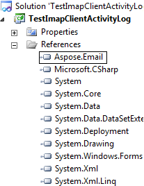

[ImapClient](https://reference.aspose.com/email/net/aspose.email.clients.imap/imapclient/) activity can be logged by modifying the configSections in the config file. Following are the steps to perform diagnostics logging:

1. Add a **sectionGroup** called "applicationSettings".
1. Add a **section** called "Aspose.Email.Properties.Settings".
1. Include the setting ImapDiagonosticLog where the file name is defined in the **applicationSettings/Aspose.Email.Properties.Settings**.

Here is a sample form application which uses [ImapClient](https://reference.aspose.com/email/net/aspose.email.clients.imap/imapclient/) to process mail. This whole activity is logged by modifying the App.config file.

- Create a form based application with a single button on it. Add the following sample code for button's click:



- Add a reference to Aspose.Email.

|| |
| :- | :- |

- Now add the App.Config file and modify it so that the file contents are as follows:



For C# .NET use the following option

|| |
| :- | :- |
For VB .NET use the following option

|| || |
| :- | :- | :- | :- |

|| |
| :- | :- |

- Run the code and then observe Log folder. The following file will be generated.

|| |
| :- | :- |

## **Enable Activity Logging using appsettings.json File**

> **_NOTE:_** This option is preferred for .NET Core applications.

Logging in [ImapClient](https://reference.aspose.com/email/net/aspose.email.clients.imap/imapclient/) can be enabled with the following steps and code samples:

1. Add an appsettings.json configuration file to a C# project, if it has not been added before. 
2. Make sure that the project file contains the following lines in the ItemGroup section.

```xml
   <Content Include="appsettings.json">
       <CopyToOutputDirectory>Always</CopyToOutputDirectory>
   </Content>
```

3. Then, add the following content to the appsettings.json file.

```json
   {
     "ImapDiagnosticLog": "imap.log",
     "ImapDiagnosticLog_UseDate": true
   }
```

The two properties mentioned above are:

- **ImapDiagnosticLog** - specifies the relative or absolute path to the log file.

- **ImapDiagnosticLog_UseDate** - specifies whether to add a string representation of the current date to the log file name.

## **Enable Activity Logging in Programm Code**

You can also enable logging immediately in the code. 

> **_NOTE:_** even if you have already enabled logging by using configuration files, this option will be applied.

Logging in [ImapClient](https://reference.aspose.com/email/net/aspose.email.clients.imap/imapclient/) can be enabled with the following steps and code samples:

1. Create an [ImapClient](https://reference.aspose.com/email/net/aspose.email.clients.imap/imapclient/).
2. Set the path to the log file using the [LogFileName](https://reference.aspose.com/email/net/aspose.email.clients/emailclient/logfilename/) property.
3. Set the [UseDateInLogFileName](https://reference.aspose.com/email/net/aspose.email.clients/emailclient/usedateinlogfilename/) property if it is necessary.

```cs
   using (var client = new ImapClient("your imap server", 993, "your username", "your password"))
{
    // Set security mode
    client.SecurityOptions = SecurityOptions.Auto;

    // Set the path to the log file using the LogFileName property.
    client.LogFileName = @"C:\Aspose.Email.IMAP.log";

    // Set the UseDateInLogFileName property if it is necessary.
    client.UseDateInLogFileName = false;
}
```
