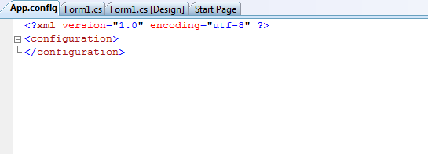

[ImapClient](https://apireference.aspose.com/email/net/aspose.email.clients.imap/imapclient) activity can be logged by modifying the configSections in the config file. Following are the steps to perform diagnostics logging:

1. Add a **sectionGroup** called "applicationSettings".
1. Add a **section** called "Aspose.Email.Properties.Settings".
1. Include the setting ImapDiagonosticLog where the file name is defined in the **applicationSettings/Aspose.Email.Properties.Settings**.

Here is a sample form application which uses [ImapClient](https://apireference.aspose.com/email/net/aspose.email.clients.imap/imapclient) to process mail. This whole activity is logged by modifying the App.config file.

- Create a form based application with a single button on it. Add the following sample code for button's click:



- Add a reference to Aspose.Email.

|| |
| :- | :- |
- Now add the App.Config file and modify it so that the file contents are as follows:



For C# .NET use the following option

|| |
| :- | :- |
For VB .NET use the following option

|| || |
| :- | :- | :- | :- |

|| |
| :- | :- |
- Run the code and then observe Log folder. The following file will be generated.

|| |
| :- | :- |

